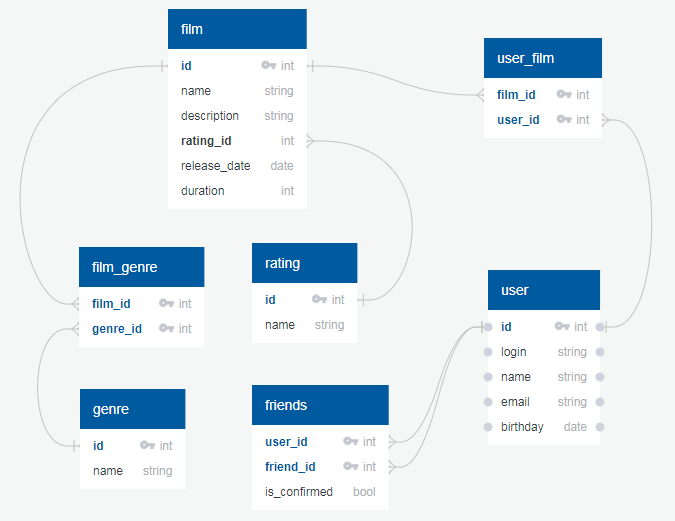

# java-filmorate

## Структура БД

Схема структуры БД представлена на рисунке



### Список таблиц

* **film** - список фильмов
* **genre** - список жанров фильмов
* **film_genre** - таблица для связи фильмов с жанрами (у одного фильма может быть несколько жанров) 
* **rating** - список возрастных ограничений (рейтинг MPA)
* **user** - список пользователей
* **user_film** - список пользователей, поставивших лайк фильму
* **friends** - список друзей пользователя

### Примеры запросов

**1. Получить 10 самых популярных фильмов:**

```
SELECT 
  film.id, film.name, 
  (SELECT count(*) FROM user_film WHERE film.id = user_film.film_id) AS count_likes
FROM film 
ORDER BY count_likes DESC, film.name 
LIMIT 10
```

**2. Список друзей пользователя**

```
SELECT friends.friend_id, user.name
FROM friends
  JOIN user ON friends.friend_id = user.id
WHERE friends.user_id = {user_id}
ORDER BY user.name
```

**3. Список общих друзей**

```
SELECT u.*
FROM friends AS f1
  INNER JOIN friends AS f2 on f1.friend_id = f2.friend_id  
  INNER JOIN `user` AS u ON f1.friend_id = u.id
WHERE f1.user_id = {user_id_1}
  AND f2.user_id = {user_id_2}
ORDER BY u.name
```


